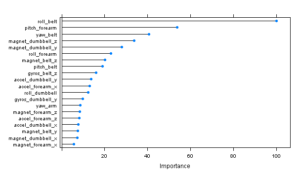
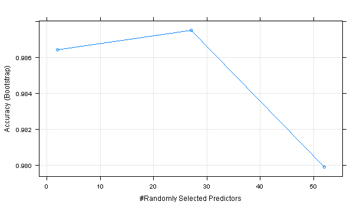

##Executive Summary
In this project, we will be using data from accelerometers on the belt, forearm, arm, and dumbell of 6 participants. They were asked to perform barbell lifts correctly and incorrectly in 5 different ways. More information is available from the website here: http://groupware.les.inf.puc-rio.br/har (section on "Weight Lifting Exercise"). 

The goal of your project is to predict the manner in which they did the exercise. This is the "classe" variable in the training set.

### Content Breakdown
1. Formatting and cleaning data
2. Cross validation setup
3. Modeling (5 attempts)
4. Out of sample error
5. Final prediction test

## 1. Formatting and cleaning data
We read in the training data, and from observation see that we can remove several irrelevant columns.
```{r, eval=FALSE}
trainingData <- read.csv(file="pml-training.csv") 
head(trainingData)

```
We mark the following for removal, because they are administrative data that we don't want to train with.
```{r, eval=FALSE}
dropList1 <- c("user_name", "raw_timestamp_part_1","raw_timestamp_part_2","cvtd_timestamp","new_window","num_window")
```
We also want to remove the below because they contain things like nulls, NA, or errornous data.
```{r, eval=FALSE}
dropList2 <- c("kurtosis_roll_belt","kurtosis_picth_belt","kurtosis_yaw_belt","skewness_roll_belt","skewness_roll_belt.1","skewness_yaw_belt","max_roll_belt","max_picth_belt","max_yaw_belt","min_roll_belt","min_pitch_belt","min_yaw_belt","amplitude_roll_belt","amplitude_pitch_belt","amplitude_yaw_belt","var_total_accel_belt","avg_roll_belt","stddev_roll_belt","var_roll_belt","avg_pitch_belt","stddev_pitch_belt","var_pitch_belt","avg_yaw_belt","stddev_yaw_belt",
               "var_yaw_belt")

dropList3 <- c("var_accel_arm","avg_roll_arm","stddev_roll_arm","var_roll_arm","avg_pitch_arm","stddev_pitch_arm","var_pitch_arm","avg_yaw_arm","stddev_yaw_arm","var_yaw_arm",
               "kurtosis_roll_arm","kurtosis_picth_arm","kurtosis_yaw_arm","skewness_roll_arm","skewness_pitch_arm","skewness_yaw_arm","max_roll_arm","max_picth_arm","max_yaw_arm","min_roll_arm","min_pitch_arm","min_yaw_arm","amplitude_roll_arm","amplitude_pitch_arm","amplitude_yaw_arm"
)

dropList4 <- c("kurtosis_roll_dumbbell","kurtosis_picth_dumbbell","kurtosis_yaw_dumbbell","skewness_roll_dumbbell","skewness_pitch_dumbbell","skewness_yaw_dumbbell","max_roll_dumbbell","max_picth_dumbbell","max_yaw_dumbbell","min_roll_dumbbell","min_pitch_dumbbell","min_yaw_dumbbell","amplitude_roll_dumbbell","amplitude_pitch_dumbbell","amplitude_yaw_dumbbell")

dropList5 <- c("var_accel_dumbbell","avg_roll_dumbbell","stddev_roll_dumbbell","var_roll_dumbbell","avg_pitch_dumbbell","stddev_pitch_dumbbell","var_pitch_dumbbell","avg_yaw_dumbbell","stddev_yaw_dumbbell","var_yaw_dumbbell")

dropList6 <- c("kurtosis_roll_forearm","kurtosis_picth_forearm","kurtosis_yaw_forearm","skewness_roll_forearm","skewness_pitch_forearm","skewness_yaw_forearm","max_roll_forearm","max_picth_forearm","max_yaw_forearm","min_roll_forearm","min_pitch_forearm","min_yaw_forearm","amplitude_roll_forearm","amplitude_pitch_forearm","amplitude_yaw_forearm")

dropList7 <- c("var_accel_forearm","avg_roll_forearm","stddev_roll_forearm","var_roll_forearm","avg_pitch_forearm","stddev_pitch_forearm","var_pitch_forearm","avg_yaw_forearm","stddev_yaw_forearm","var_yaw_forearm")
```

We then proceed to remove them from the dataset.
```{r, eval=FALSE}
trainingData <- trainingData[, !colnames(trainingData) %in% dropList1]
trainingData <- trainingData[, !colnames(trainingData) %in% dropList2]
trainingData <- trainingData[, !colnames(trainingData) %in% dropList3]
trainingData <- trainingData[, !colnames(trainingData) %in% dropList4]
trainingData <- trainingData[, !colnames(trainingData) %in% dropList5]
trainingData <- trainingData[, !colnames(trainingData) %in% dropList6]
trainingData <- trainingData[, !colnames(trainingData) %in% dropList7]
trainingData <- trainingData[, !colnames(trainingData) %in% 'X']
```
We set the classe as factor variable.
```{r, eval=FALSE}
trainingData$classe <- as.factor(trainingData$classe)
```

## 2. Cross validation setup
For this purpose, we choose to further split the training data(pml-training.csv) into 3 parts. Set A for training our models, set B for testing the model fit, and set C to perform out of sample error.

* Data set A: trainData 60%
* Data set B: testData 20%
* Data set C: validateData 20%

```{r, eval=FALSE}
library(caret)
set.seed(3523)
trainingIndex <- createDataPartition(trainingData$classe, p = 0.6, list=FALSE, times=1)
# data set A
trainData <- trainingData[ trainingIndex, ]
testNvalidateData <- trainingData[ -trainingIndex, ]
# Further split into sets B and C
testNvalidateIndex <- createDataPartition(testNvalidateData$classe, p=0.5, list=FALSE, times=1)
# data set B
testData <- testNvalidateData[testNvalidateIndex,]
# data set C
validateData <- testNvalidateData[-testNvalidateIndex,]

```

## 3. Modeling (5 attempts)
Model 1: We try a straight forward random forest approach. Training control was not set. Pre-processing is also not performed.
```{r, eval=FALSE}
set.seed(62433)
# attempt with random forest
rfFit <- train(trainData$classe ~., method='rf', data=trainData)
rfPrediction <- predict(rfFit, newdata= testData)
rfCM <- confusionMatrix(testData$classe, rfPrediction)
```
**Overall figures reported by model 1:**
We see that accuracy reported is already very high. But lets go on to create more models.
                                          
               Accuracy : 0.9901          
                 95% CI : (0.9864, 0.9929)
    No Information Rate : 0.2868          
    P-Value [Acc > NIR] : < 2.2e-16       
                                          
                  Kappa : 0.9874          


Model 2: We now try an attempt with GBM to see what figures we get. Also, no training controls or preprocessing is setup.
```{r, eval=FALSE}
gbmFit <- train(trainData$classe ~., method='gbm', data=trainData, verbose=FALSE)
gbmPrediction <- predict(gbmFit, newdata= testData)
gbmCM <- confusionMatrix(testData$classe, gbmPrediction)
```
**Overall figures reported by model 2:**
We see that accuracy and kappa value in this model has dropped slightly.
                                          
               Accuracy : 0.9641          
                 95% CI : (0.9577, 0.9697)
    No Information Rate : 0.286           
    P-Value [Acc > NIR] : < 2.2e-16       
                                          
                  Kappa : 0.9545          

Let us just pause and compare the root mean squared error (RMSE). RF has value of 0.137, GBM has value of 0.271 
```{r, eval=FALSE}
# check RMSE
sqrt(mean( (as.numeric(rfPrediction)-as.numeric(testData$classe))^2) )
sqrt(mean( (as.numeric(gbmPrediction)-as.numeric(testData$classe))^2) )
```

Model 3: Lets explore what else we can do with the GBM model. Maybe we could try to reduce computing time by removing variables (feature selection) without sacrificing accuracy.
We use the varImp function.
```{r, eval=FALSE}
gbmImp <- varImp(gbmFit, scale=TRUE)
plot(gbmImp, top=20)
```


We then choose to shortlist the top 12 variables above 10% weighted, cutting our variables futher down to 20.
```{r, eval=FALSE}
gbmShortlist <- c('roll_belt',         
               'pitch_forearm',     
               'yaw_belt',          
               'magnet_dumbbell_z', 
               'magnet_dumbbell_y', 
               'roll_forearm',      
               'magnet_belt_z',     
               'pitch_belt',        
               'gyros_belt_z',      
               'accel_dumbbell_y',  
               'accel_forearm_x',   
               'roll_dumbbell', 'classe')
```

We then try to train the model with the reduced dataset. The training speed is faster, but accuracy is slightly compromised.
```{r, eval=FALSE}
trainDataReduced <- trainData[,gbmShortlist]
testDataReduced <- testData[,gbmShortlist]

gbmFitReduced <- train(trainDataReduced$classe ~., method='gbm', data=trainDataReduced, verbose=FALSE)
gbmPredictionReduced <- predict(gbmFitReduced, newdata= testDataReduced)
gbmCMReduced <- confusionMatrix(testDataReduced$classe, gbmPredictionReduced)
```
**Overall figures reported by model 3:**
                                          
               Accuracy : 0.9391          
                 95% CI : (0.9311, 0.9464)
    No Information Rate : 0.2819          
    P-Value [Acc > NIR] : < 2e-16         
                                          
                  Kappa : 0.923           

And not forgetting the RMSE value of 0.372
```{r, eval=FALSE}
sqrt(mean( (as.numeric(gbmPredictionReduced)-as.numeric(testDataReduced$classe))^2) )
```

Model 4: VarImp was performed on the random forest model as well to see what figures we could get. Its understood however that RF has in built feature selection. We thus should not expect much difference in accuracy from model 1.
This time 19 variables were selected. (Code and variable details are not included here)

**Overall figures reported by model 4:**

               Accuracy : 0.9903          
                 95% CI : (0.9867, 0.9931)
    No Information Rate : 0.2865          
    P-Value [Acc > NIR] : < 2.2e-16       
                                          
                  Kappa : 0.9877          

RMSE value reported as: 0.134
```{r, eval=FALSE}
sqrt(mean( (as.numeric(rfPredictionReduced)-as.numeric(testDataReduced$classe))^2) )
```

Model 5: Now we try to perform some PCA preprocessing. Lets see how this method helps to reduce data dimensions.

```{r, eval=FALSE}
preProc <- preProcess(trainData[-53], method='pca', thresh=0.99)
trainPreProc <- predict(preProc, trainData[-53])
preProcRFModel <- train(trainData$classe ~., data=trainPreProc, method='rf')
preProcRFModel

preProcRFModelPredict <- predict(preProc, newdata=testData[-53])

preProcRFModelCM <- confusionMatrix(testData$classe, predict(preProcRFModel, preProcRFModelPredict))
```
**Overall figures reported by model 5:**
We found that PCA needed 37 components to capture 99 percent of the variance. Accurary is also pretty decent. But at the cost of heavy processing of PCA algorithms, it seems debatable whether this approach is optimal in our case.

               Accuracy : 0.9737          
                 95% CI : (0.9682, 0.9785)
    No Information Rate : 0.2886          
    P-Value [Acc > NIR] : < 2.2e-16       
                                          
                  Kappa : 0.9668          
    
 
## 4. Out of sample error
Finally, we perform our best model (model attempt 1) on the validation data to calculate our out of sample error. We get an out of sample error of 0.00892

We provide a plot of model 1 (rfFit).


```{r, eval=FALSE}
validateDataPrediction <- predict(rfFit, newdata= validateData)
length(validateDataPrediction)

out.sample.error.ratio <- sum(validateDataPrediction==validateData$classe)/length(validateDataPrediction)
out.sample.error.rate <- (1-out.sample.error.ratio)
# out of sample error of 0.00892
```

## 5. Final prediction test
Lets setup the prediction data (pml-testing.csv) for the final predictive test. We remove the same unwanted columns as earlier, and set our classe factor variable. We then derive our final results (submitted in a seperate exercise).

```{r, eval=FALSE}
finalPredictData <- read.csv(file="pml-testing.csv") 
finalResults <- predict(rfFit, finalPredictData)
```
In summary, we found that our first model successfully predicted the outcome in pml-testing.csv. As seen in the above modeling work, it is also not always the case, where more work or manipulation equates to more accurate results. We suggest that this could be due to the large training dataset available, or the ability of available algorithms to perform most of the heavy lifing for us.


